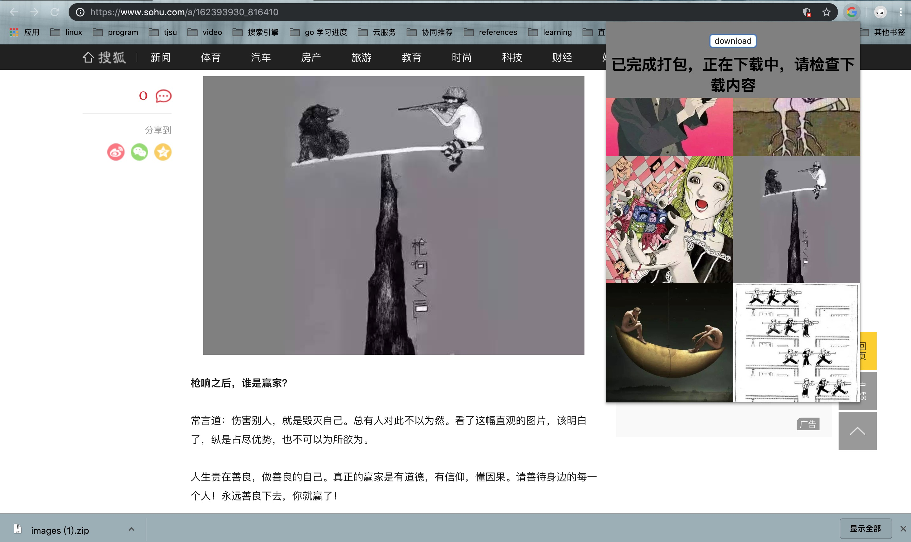

# 描述
chrome插件，可以抓取当前页面中的图片，筛选图片，并打包下载

# 安装方法1 -- bin/pic_capture.crx安装包
比较复杂，因为是非chrome商店的插件，所以需要设置白名单，自行谷歌

# 安装方法2
1. 进入chrome设置 -> 更多工具 -> 扩展程序
2. 打开开发者模式
3. 加载已解压的扩展程序
4. 选择下载的目录（包含manifest.json的那个目录）

# 操作
1. 默认下载所有的图片（如果浏览器还没加载到该图片，则不会被下载，可以将滚动条拉到底，以加载所有图片）
2. 如果不需要某张图片，可以单击该图片，它会变透明（下载时，会去除不要的图）
3. 点击download

# TODO - 也可能不做
1. gif图片会被处理成静态图片
2. 某些未知的bug